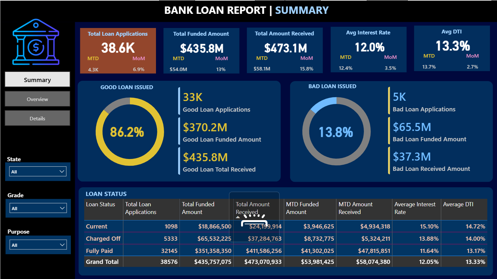
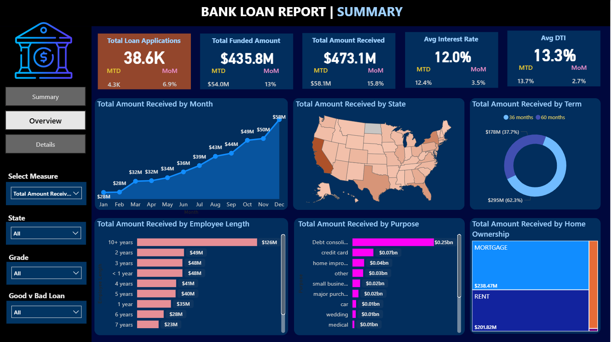
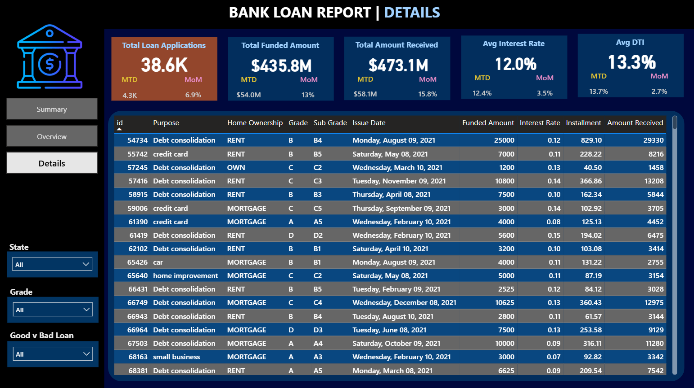

# 🏦 Bank Loan Analysis Dashboard

An interactive **Power BI dashboard** built to analyze **38,577 bank loan records**. The project focuses on cleaning and transforming raw data, validating business metrics using SQL, and building interactive dashboards to monitor loan performance, repayment trends, customer demographics, and lending risk.

---

# 📌 Project Objectives

- Analyze historical bank loan data to identify lending trends.
- Track overall loan performance using business KPIs.
- Compare Good Loans vs Bad Loans.
- Identify customer demographics and borrowing patterns.
- Support data-driven decision-making through interactive dashboards.

---

# 🛠️ Tools & Technologies

- Power BI
- SQL Server
- SQL
- DAX
- Power Query
- Microsoft Excel

---

# 📂 Dataset

- **Total Records:** 38,577
- **Source:** Financial Loan Dataset
- Data was cleaned, transformed, and validated before visualization.

Dataset includes:

- Loan Applications
- Funded Amount
- Amount Received
- Interest Rate
- Debt-to-Income Ratio (DTI)
- Home Ownership
- Loan Purpose
- Employee Length
- Grade & Subgrade
- Loan Status
- State Information

---

# 📈 Key Performance Indicators (KPIs)

The dashboard tracks the following KPIs:

- Total Loan Applications
- Total Funded Amount
- Total Amount Received
- Average Interest Rate
- Average Debt-to-Income Ratio (DTI)
- Month-to-Date (MTD) Metrics
- Month-over-Month (MoM) Growth

---

# 📊 Dashboard Pages

---

## 1️⃣ Summary Dashboard

Provides a high-level overview of overall lending performance.

### Features

- Good Loan vs Bad Loan Analysis
- Loan Status Breakdown
- Total Applications
- Funded Amount
- Amount Received
- Average Interest Rate
- Average DTI
- MTD & MoM KPIs
- Interactive Filters
  - State
  - Grade
  - Loan Purpose

### Dashboard Preview

<p align="center">

</p>

---

## 2️⃣ Overview Dashboard

Provides detailed business insights through interactive visualizations.

### Visualizations

- Monthly Amount Received Trend
- State-wise Loan Distribution
- Loan Term Analysis
- Employee Length Analysis
- Loan Purpose Analysis
- Home Ownership Distribution

### Interactive Filters

- State
- Grade
- Loan Quality
- Measure Selection

### Dashboard Preview

<p align="center">

</p>

---

## 3️⃣ Details Dashboard

Provides transaction-level loan data for detailed analysis.

### Features

- Complete Loan Record Table
- Loan Purpose
- Home Ownership
- Grade & Sub Grade
- Issue Date
- Funded Amount
- Interest Rate
- Installment
- Amount Received

### Interactive Filters

- State
- Grade
- Good/Bad Loan

### Dashboard Preview

<p align="center">

</p>

---

# 🔍 SQL Validation

All dashboard KPIs were independently validated using SQL queries before visualization.

The SQL analysis includes:

- Total Loan Applications
- MTD & PMTD Loan Applications
- Funded Amount
- Amount Received
- Average Interest Rate
- Average DTI
- Good Loan Percentage
- Bad Loan Percentage
- Loan Status Summary
- State-wise Metrics
- Purpose-wise Analysis

---

# 💡 Key Insights

- Good Loans account for **86.2%** of total loan applications.
- Bad Loans contribute **13.8%** of total applications.
- Total Funded Amount exceeded **$435M**.
- Total Amount Received reached **$473M**.
- Debt Consolidation represents the largest loan purpose.
- Mortgage and Rent account for the majority of home ownership categories.
- Loan repayments show a consistent upward trend throughout the year.

---

# 📁 Repository Structure

```
📦 Bank-Loan-Analysis-Dashboard
│
├── Bank Loan Analysis PowerBI.pbix
├── financial_loan.csv
├── SQLQuery1.sql
├── Summary.png
├── Overview.png
├── Details.png
└── README.md
```

---

# 🎯 Skills Demonstrated

- Data Cleaning
- Data Transformation
- SQL Analysis
- Business Intelligence
- Power BI
- DAX
- Power Query
- KPI Development
- Dashboard Design
- Data Visualization
- Business Analytics

---

## ⭐ If you found this project helpful, consider giving it a star!
